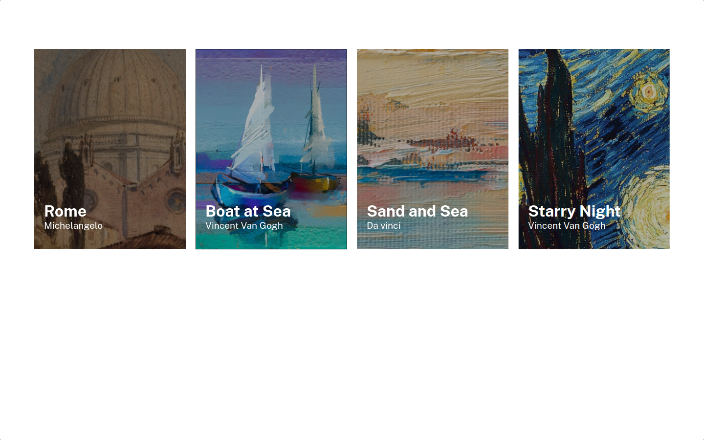
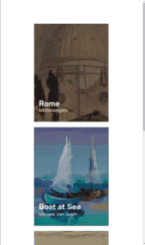
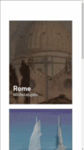

# Lista de imagens

#### O exercício lista de imagens faz parte dos exercícios de CSS avançado do curso de formação Fullstack da DEV QUEST - Dev em Dobro. O exercício tem o objetivo de consolidar conceitos avançados de CSS. Obrigado por conferir o meu cógigo.

## Índice

- [Captura de tela](#captura-de-tela)
- [Links](#links)
- [Construído com](#construído-com)
- [O que aprendi](#o-que-aprendi)
- [Desenvolvimento contínuo](#desenvolvimento-contínuo)
- [Recursos úteis](#recursos-úteis)
- [Fernando Mendes](#autor)

### Captura de tela

#### Tela Desktop



#### Tela Ipad



#### Tela Mobile



### Links

- Site URL: https://nandosti.github.io/menu-flexbox/

### Construído com

<div style="display: inline_block"><br>
  
         
</div>

## O que aprendi

Neste projeto explorei e aprimorei minhas habilidades em resposividade e posicionamento de elementos usando position relative e position absolute. Este exercício me proporcionou uma compreensão das práticas de design responsivo e da manipulação de elementos HTML e CSS para criar interfaces funcionais em diversos tamanhos de tela.


## Trechos de códigos

```
.container{
    display: flex;
    flex-wrap: wrap;
    justify-content: center;
    padding: 100px 15px;
    gap: 20px;
}

.container .card-img{
    position: relative;
}

.container .card-img img{
    width: 310px;
    height: 410px;
}

.container .text{
    position: absolute;
    bottom: 20px;
    padding: 20px;
}

.container .text h1{
    font-size: var(--font-size-title);
    font-weight: 700;
}

.container .text p{
    font-size: var(--font-size-author);
    font-weight: 400;
}

```

## Desenvolvimento contínuo

Pretendo continuar focado em construir um conhecimento sólido nessas tecnologias. Ainda há muitos conceitos importantes para serem desenvolvidos. Todos os dias aprendo novos conceitos que são gradativamente adicionados ao meu repertório de ferramentas.

## Recursos úteis

- [W3School](https://www.w3schools.com/css/default.asp) - Esse site sempre me ajuda a resolver qualquer problema relacionados a códigos de uma maneira fácil e muito rápida.
- [Dev em Dobro](https://www.youtube.com/@DevemDobro) - Este é um canal onde encontro muito material. Tem muito conteúdo relacionado ao desenvolvimento. Recomendo a todos que querem aprender sobre esse e outros conceitos relacionados.

## Autor

[Fernando Mendes](https://www.linkedin.com/in/fernandomendesti/)
